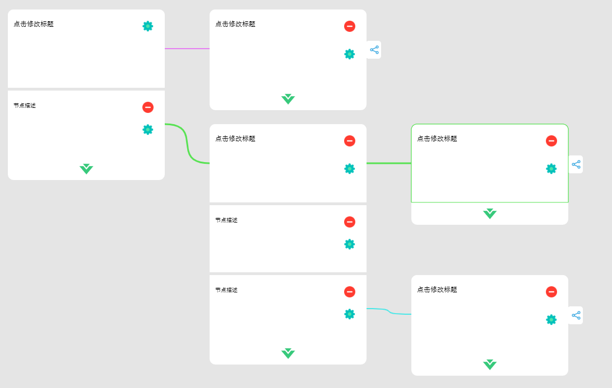

# 情形化插件

## 开发

### idea 设置

> 开启 typescript 自动编译, 切勿在所有项目都开启, 否则会影响其他项目


### 添加 live-server

```sh
# 全局添加 live-server
npm install -g live-server
# 开启一个新的 cmd, 测试是否可以
live-server --help
```

### 开发调试

1. 修改 ts 文件, 注意不是修改 js 文件
2. 在项目根目录下执行 `live-server --port=8080`
3. 打开浏览器 [127.0.0.1:8080](127.0.0.1:8080)

### 编译

1. 全局添加 typescript

   ```sh
   npm install -g typescript
   ```

2. 执行 `deploy.bat`

## 项目中使用

### 普通版本

> 见 98_standard 中情形化材料一节的使用

### ES6 版本

```html
<!--在页面中定义一个画布容器-->
<div id='canvasC'></div>
<script>
	// 定义好全局变量, 因为使用 module 方式引入项目, 不能在外部调用
    var flow;
</script>
<!--使用 module 的方式引入, 如果是 vue 项目, 直接引入即可-->
<script type="module">
  import CanvasTreeFlow from "./index.js"
  flow = new CanvasTreeFlow({
  // 画布容器 id, 一般定义一个 div
  elem?: string
  // 根节点 id
  initId?: string
  // 初始化历史数据
  initData: any,
  // 初始化钩子
  initDataFun?: (data: object) => any
  // 编辑事件, 返回当前编辑元素的 id, 类型 (title|block), 回调函数
  onEdit?: (id: string, type: string, callback: (text) => any) => any,
  // 选择事件, 返回选择的 Id, 类型 (node|block), 回调函数
  onSelect?: (id: string, type: string, callback: (text) => any) => any,
  // 删除事件, 返回当前删除元素的 id, 类型 (title|block), 回调函数
  onDel?: (id: string, type: string, callback: (text) => any) => any,
  // 添加节点事件, 返回新节点 id, 是否是根节点(并行节点), 前驱节点 id, 回调函数
  onAddNode?: (id: string, ifRoot: boolean, nodeId: string, callback: (text) => any) => any,
  // 添加内容块事件, 返回新内容块 id, 回调函数
  onAddBlock?: (id: string, callback: (text) => any) => any,
  // 保存事件, 返回序列化 json
  onSave?: (data: string) => any,
  // 添加按钮高度
  add_btn_h?: 40, 
  // 标题高度
  title_h?: 180,
  // 标题宽度
  title_w?: 340,
  // 内容块高度
  block_h?: 120,
  // 内容块宽度
  block_w?: 340,
  // 画布初始高度
  canv_h?: 900,
  // 画布初始宽度
  canv_w?: 1600,
  // 图标大小
  icon_size?: 25,
  // 节点标题字体
  title_font?: '18px Arial',
  // 内容块字体
  block_font?: '16px Arial',
  // 是否启用贝塞尔连线, 默认为折线
  bezier?: boolean,
  // 线色-完全并行
  parallel_line?: string,
  // 线色-局部并行
  mix_line?: string,
  // 线色-串行
  serial_line?: string,
  // 线色-当前流程
  active_line?: string, 
  // 连线线宽
  conn_line_width?: 2,
})
</script>
```

## 运行示例

